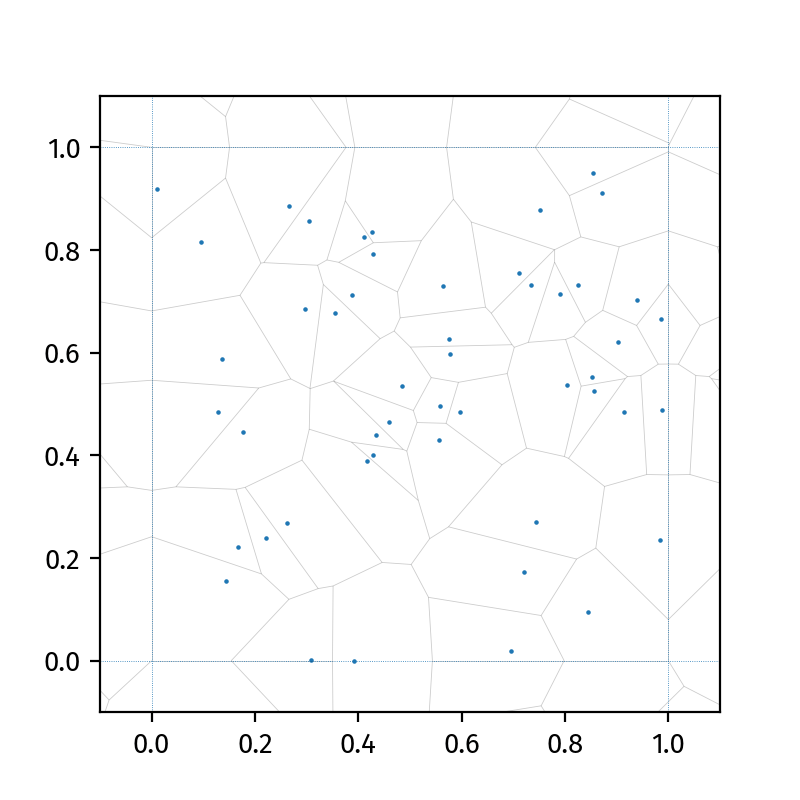

# Thinking and Overthinking in Group Formation
This project was carried out by [Pranav Minasandra](pminasandra.github.io) and
[Cecilia Baldoni](cecibaldoni.github.io) in December 2024.



# Selfish Herd simulations with recursive anticipation of conspecific movement

This code simulates Hamilton's (1971) model of aggregation in groups of selfish
agents attempting to maximise their own individual probabilities of survival.
Hamilton showed that this selfish movement pattern leads to aggregation, and
proposed that this could partially explain the evolutionary origins of
sociality.

Among a wide range of other abilities, animals that possess a Theory of Mind are
able to anticipate each others' behaviours and appropriately modify their own
behaviours in response. 

We asked what would happen if we granted a Theory of Mind to each agent in
a Hamiltonian Selfish Herd. Specifically, we wanted to know whether animals that
can anticipate each others' selfish decisions and respond (still in a selfish
manner) themselves form groups better: i.e., do they form larger groups, or form
groups faster? More fundamentally, Hamilton's selfish agents act by minimising
their own domains of danger (which are basically Voronoi polygons for each
agent). We also asked whether anticipating other agents' behaviours led to
smaller domains of danger for each agent.

# Specifics

Our agents use the Voronoi tesselation method from `scipy.spatial`. Agents move
by performing a gradient descent on their Voronoi polygon area. The herd is
bounded to the unit square, thus all Voronoi polygons are finite. Anticipation
of other agents' behaviours is done recursively. We go up to 3 layers of
recursion (i.e., "(0) I want to go here; (1) Wait everyone else will be there
instead, so I should instead go here; (2) Everyone else is also gonna think in
the same way, so I should update my movement decision; (3) Ah, but everyone will
think that as well, let me make my final movement decision update.") You can add
more layers of reasoning, but beware, the computational costs are surprisingly
huge even with just a hundred individuals.

Trajectories with all levels of decision making will soon be made available
here.

# Installation

Make sure you have the following installed: 

- `numpy`
- `scipy`
- `pandas`

Make the following directory structure:
```
Project-Directory/
|
|-- Data/
|
|-- Figures/
```

Further, in the Project-Directory, run:
```
git clone https://github.com/pminasandra/selfish-herd-social-competence code
```

In the resulting code directory, create a file named `.cw` containing only one
line: the complete file-path for Project-Directory/ 

Then run `python3 main.py`.


**Note:** simulating the trajectories requires a lot
of computational power and will take a very long time. We will soon make our
trajectories available for you to work with.


## Reproducibility for R script

The repository includes an R script `plot.R` that generated figures from the data. The script is set up to ensure that the required R libraries are installed and their versions match the development environment. This is managed using the `renv` package.

The script automatically installs `renv` if not already installed:
```
if (!requireNamespace("renv", quietly = TRUE)) {
  install.packages("renv") }
```
The script also restores the required R environment, ensuring all libraries and versions match the development setup:

```
renv::restore()
```


# Bibliography
Hamilton, W. D. (1971). Geometry for the selfish herd. Journal of theoretical Biology, 31(2), 295-311.
